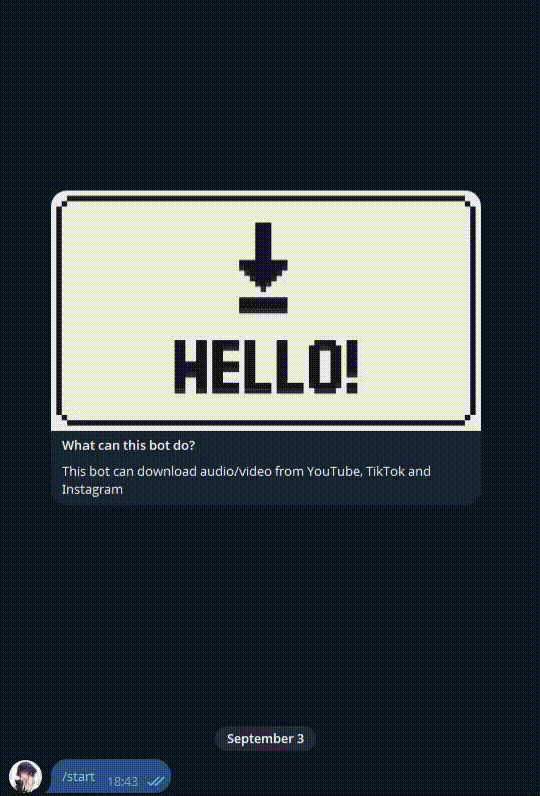
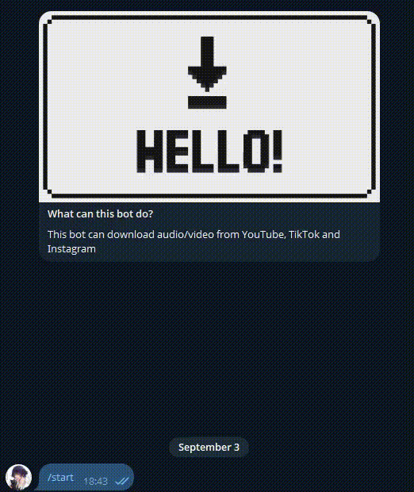

<div align="center" markdown="1">
  

  <h1 align="center">Video Downloader Bot</h1>

  
  
  
  
  

  A simple Telegram bot built with [aiogram](https://docs.aiogram.dev/) that allows you to download videos from **YouTube**, **TikTok**, and **Instagram** directly in your Telegram chat.
</div>

## Features

- Download videos from:
  - YouTube  
  - TikTok  
  - Instagram  
- Sends the video or audio file directly to the chat  
- Simple interface with link recognition
- Supports sending videos above Telegram limits (50mb) with [telethon](https://docs.telethon.dev/en/stable)

---
## Examples 

### Youtube 

<br>

### Youtube audio downloading

<br>

### Instagram downloading

<br>

### TikTok downloading



---

## Getting Started

### 1. Clone the repository
```bash
git clone https://github.com/mishkFrede1/VideoDownloaderBot
```

### 2. Create and activate virtual environment
```bash
python -m venv venv
source venv/bin/activate   # Linux & macOS
venv\Scripts\activate      # Windows
```

### 3. Install dependencies
```bash
pip install -r requirements.txt
```
### 4. Set environment variables
Create a .env file in the project root:
```bash
# token from @BotFather
BOT_TOKEN=your_telegram_bot_token_here
```
If you want to download videos above 50mb, you should also set these variables:
```bash
API_ID=your_telegram_api_id
API_HASH=your_telegram_api_hash
PHONE=your_phone_number
```

### 5. Run the bot
```bash
python main.py
```

## 🛠 Usage

Send a video link (YouTube / TikTok / Instagram) to the bot. It will recognize your platform and download it.

The bot will download and send you the video file.

Commands:
- /start - Start bot
- /help - Show help instructions
- /youtube – Download video/audio from YouTube
- /inst – Download video from Instagram
- /tiktok – Download video from TikTok
